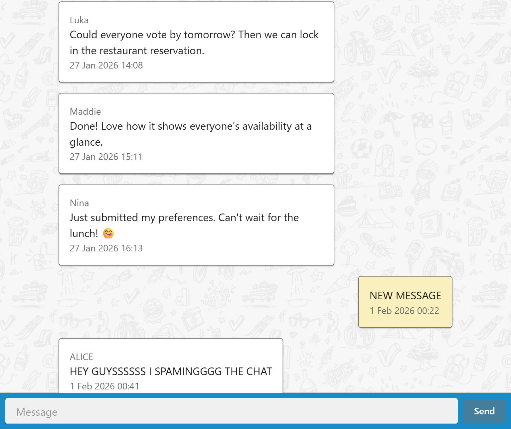
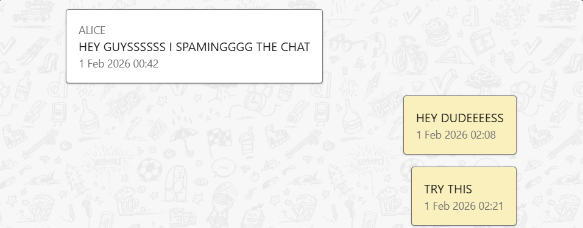
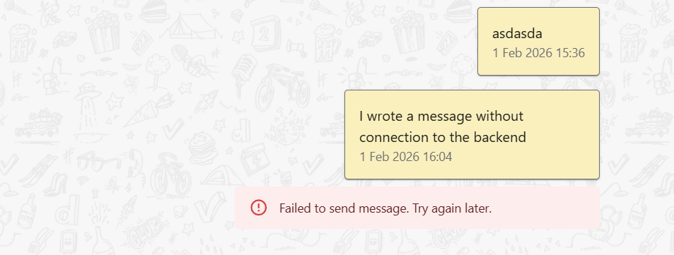
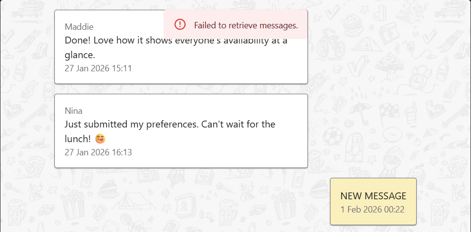

# Doodle Frontend Challenge - Facundo Ferreira

Welcome to my implementation of this challenge. This project was done using VITE with VITEST, Typescript and React.

## How to run it

After cloning this project, you will need to
1. Download and run the backend project [here](https://github.com/DoodleScheduling/frontend-challenge-chat-api).
2. Run `npm i` on this project to install every dependency.
3. Create an `.env` file and fill it with your backend api token. Use the `.env.example` as a guide.
4. Run `npm run dev` to get the frontend started.

To run the tests, simply use `npm run test`.

## Features
### Retrieve Messages
This project allows you to visualize messages from the backend connecting to an API.

### Send Messages
You can also send your own messages. Currently your messages will use the name "You". Since the challange didn't ask for a way to set your name. A way of expanding on this would be to assign the messages to a user ID and make the user login.

### Error Display
If you try to send a message and it fails, you will be notified.

If it fails to retrieve messages at any time, you will also be notified

## Styling
I used [Material UI](https://mui.com/material-ui/getting-started/) for styling. This allowed me to save time by using their component and also easily modify existing ones.

I also used the [challenge project guidelines](https://github.com/DoodleScheduling/hiring-challenges/tree/master/frontend-engineer/assets) located in the assets folder.

## Why Vitest?
Vitest is ideal for quick projects. It extremely well optimized and can be built upon in the future. Next.js takes more time to set up, which unfortunately meant it wasn't fit for this quick project.